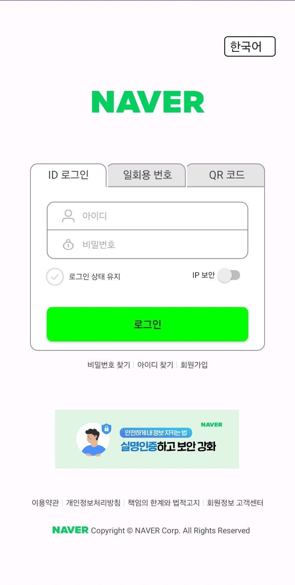
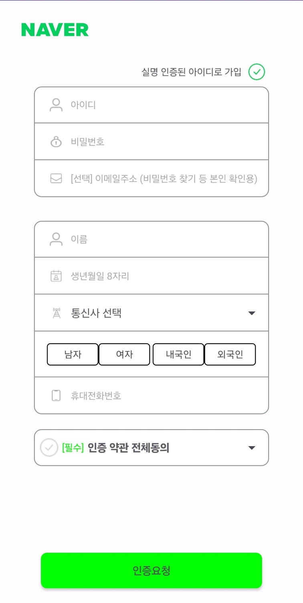

# 네이버 따라 만들기

## Android Studio와 친해지기

Project 생성 및 directory 구조에 대해 학습했습니다.

 

## Activity와 Activity LifeCycle

Activity의 개념과 활동 생명주기의 개념에 대해 학습했습니다.
 

| 메소드        | 상태        | 기능                                     |
| ------------- | ----------- | ---------------------------------------- |
| `onCreate()`  | 생성됨      | 필수 구성요소 초기화                     |
| `onStart()`   | 시작됨      | Activity가 사용자에게 표시               |
| `onResume()`  | 실행중      | 활동 스택의 맨 위에서 모든 입력을 캡쳐   |
| `onPause()`   | 일시중지됨  | 포커스를 잃음 / 액티비티의 일부가 가려짐 |
| `onStop()`    | 중지됨      | 사용자에게 더 이상 표시되지 않음         |
| `onRestart()` | 다시 시작됨 | 중지된 시간부터 활동 상태를 복원         |
| `onDestroy()` | 종료됨      | 활동 제거 및 리소스 해제                 |

 

## Layout과 Widget

LineairLayout, TableLayout, ConstraintLayout 등 Layout의 종류와 속성에 대해 공부했습니다.
 

TextView, Button, ImageView, EditText, CheckBox, Spinner 등 다양한 UI 컴포넌트를 포함하는 레이아웃을 디자인 했습니다.

 

## Intent

Activity 간 전환을 위한 명시적 인텐트를 활용했습니다.

 

### 결과물

